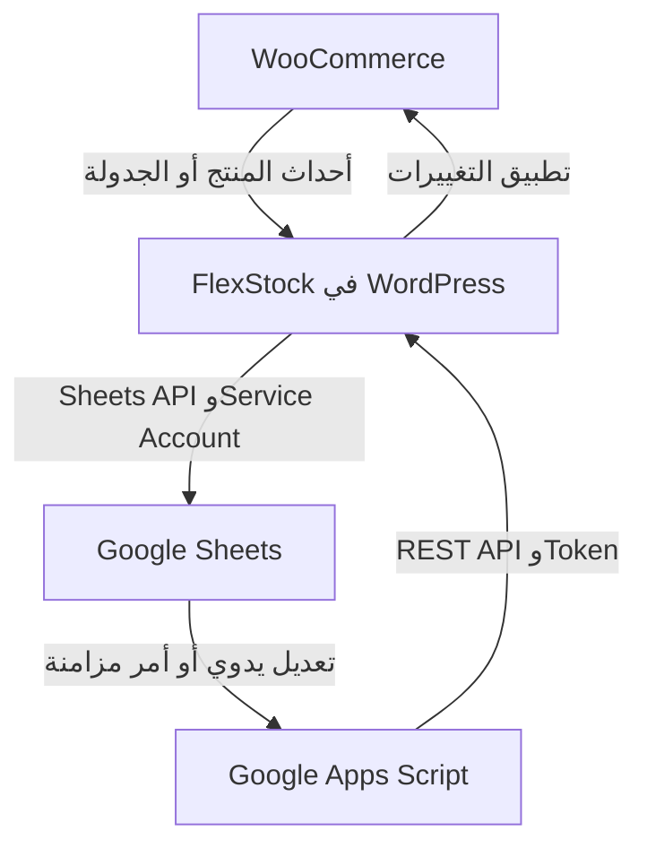

# تقرير بحثي مفصّل: FlexStock لربط WooCommerce بـ Google Sheets

**إعداد لمحمد — تاريخ البحث: 23 سبتمبر 2026**  
**الإضافة المقصودة:** Stock Sync with Google Sheet for WooCommerce، واسمها الحالي **FlexStock** من **WPPOOL**.  
**النطاق:** Free، وUltimate، والملحقات، وطريقة التشغيل، والقيود، والأسعار المنشورة، والأمان، واقتراحات تسهيل الاستخدام.

> **القرار المبدئي:** الإضافة تستحق التجربة عندما يدير فريقك المنتجات والأسعار والمخزون من Google Sheets. ابدأ بالمجاني على نسخة تجريبية؛ انتقل إلى Ultimate عندما تحتاج الحقول المتقدمة أو إنشاء المنتجات أو تتجاوز الحد المجاني. لا تعتمد على صفحات التسويق وحدها: توجد اختلافات بين بعض الوعود المنشورة وبين الكود والتوثيق.

## فهرس التقرير

1. [النتائج الأهم](#01-النتائج-الأهم)
2. [منهج البحث وحدوده](#02-منهج-البحث-وحدوده)
3. [هوية الإضافة ونطاقها](#03-هوية-الإضافة-ونطاقها)
4. [كيف تعمل تقنيا وعمليا؟](#04-كيف-تعمل-تقنيا-وعمليا)
5. [الإعداد من الصفر](#05-الإعداد-من-الصفر)
6. [المقارنة التفصيلية بين Free وUltimate](#06-المقارنة-التفصيلية-بين-free-وultimate)
7. [شرح الحقول والسلوك الفعلي](#07-شرح-الحقول-والسلوك-الفعلي)
8. [أوضاع المزامنة واختيار الأنسب](#08-أوضاع-المزامنة-واختيار-الأنسب)
9. [سيناريوهات يومية](#09-سيناريوهات-يومية)
10. [الملحقات](#10-الملحقات)
11. [الأسعار والترخيص والتكلفة الحقيقية](#11-الأسعار-والترخيص-والتكلفة-الحقيقية)
12. [الأداء وحدود Google](#12-الأداء-وحدود-google)
13. [الأمان والصلاحيات](#13-الأمان-والصلاحيات)
14. [المراجعات وسجل التحديثات](#14-المراجعات-وسجل-التحديثات)
15. [الأعطال وتشخيصها](#15-الأعطال-وتشخيصها)
16. [التعارضات وما لم يُحسم](#16-التعارضات-وما-لم-يحسم)
17. [تسهيل الاستخدام دون تعديل الإضافة](#17-تسهيل-الاستخدام-دون-تعديل-الإضافة)
18. [تحسينات مقترحة في المنتج نفسه](#18-تحسينات-مقترحة-في-المنتج-نفسه)
19. [الشراء أم التطوير المخصص؟](#19-الشراء-أم-التطوير-المخصص)
20. [خطة تجربة وقبول](#20-خطة-تجربة-وقبول)
21. [أسئلة للمطوّر قبل الشراء](#21-أسئلة-للمطور-قبل-الشراء)
22. [المصادر وأدلة الكود](#22-المصادر-وأدلة-الكود)

## 01. النتائج الأهم

- **المجاني ليس مجرد تصدير:** توجد مزامنة أساسية باتجاهين، وتحرير جماعي، ودعم لصفوف Variations. خيار Bidirectional ظاهر دون قفل مدفوع في كود النسخة المفحوصة. [C1][C2]
- **الحد الحالي المعلن 500 منتج:** يؤيده الكود وسجل التحديثات. رقم 100 الموجود في بعض الصفحات قديم. كيفية احتساب المنتجات مع Variations عند بلوغ الحد تحتاج اختبارًا؛ لا تعتبره وعدًا بـ500 منتج أب مع Variations غير محدودة. [C3]
- **Ultimate توسّع البيانات والعدد:** تشمل إنشاء منتجات، وصورًا، وأوصافًا، وAttributes، وCustom Fields، وصيغًا وخيارات مزامنة إضافية، بحسب الميزة والترخيص. [C2][S08]–[S12]
- **«لحظي» لا يعني كل المصادر:** تعديل يدوي في خلية يختلف عن تغير نتيجة Formula أو كتابة البيانات بواسطة API. الصيغ تعتمد على آلية وجدولة خاصة. [S07][S19]
- **توجد ثلاث جهات يجب ضبطها:** WordPress، وGoogle Cloud/Service Account، وGoogle Apps Script. الاستخدام اليومي أبسط من الإعداد الأول. [S04]
- **الإضافة لإدارة المنتجات أساسًا:** وجود بيانات مبيعات أو استجابة لأحداث الطلبات لا يجعلها نظامًا كاملًا لإدارة الطلبات والعملاء. WPPOOL لديها منتج منفصل اسمه FlexOrder. [S02][S27]
- **مسح صف ليس هو تغيير الحالة إلى Trash:** الكود يحتوي مسارًا ينقل المنتج إلى السلة عند استقبال هذه الحالة. لا تُعامل الشيت كواجهة يستحيل منها تعطيل منتجات. [C4]
- **Ultimate لا تلغي حدود التشغيل:** تبقى حدود Google وسرعة الاستضافة وأوقات التنفيذ والاتصال عوامل مؤثرة. [S18][S20]
- **Multi-Vendor وMulti-Store امتدادان مختلفان:** الأول لبائعين داخل Marketplace؛ الثاني لمتاجر WooCommerce متعددة. لا تفترض أنهما مشمولان في أي اشتراك أساسي. [S13][S14]
- **أكبر فرصة للتحسين:** إعداد أبسط، وشرح اتجاه البيانات بوضوح، وPreview قبل التعديل، ورسائل أخطاء قابلة للتنفيذ، وصلاحيات فعلية حسب الحقل.

## 02. منهج البحث وحدوده

اعتمد البحث على صفحة WordPress، وصفحات WPPOOL الرسمية، وتوثيق الميزات والملحقات، وشروط الشراء، ومناقشات الدعم والمراجعات، وتوثيق Google وWordPress وWooCommerce. كذلك حُمّلت حزمة **Free 3.17.1** المنشورة رسميًا وفُحصت أجزاء من PHP وJavaScript وملفات الإعداد والتحديثات. [S01][C0]

التقرير يميّز بين أربعة مستويات:

| العلامة | المقصود |
|---|---|
| **موثّق رسميًا** | المطوّر أو المنصة يذكر السلوك صراحة |
| **مؤيد بالكود** | يوجد مسار أو شرط في الحزمة المجانية المفحوصة يدعم النتيجة |
| **استنتاج** | تفسير مبني على هذه الأدلة، وليس قياسًا تشغيليًا |
| **اقتراح** | تحسين أو طريقة عمل أو اختبار من إعداد التقرير |

**لم يُجرَ تثبيت تشغيلي للإضافة، أو ربط حساب Google حقيقي، أو شراء Ultimate، أو اختبار ضغط أو اختراق.** لذلك لا يُستخدم هذا التقرير كشهادة توافق أو أمان. فحص الكود محدود بالمسارات المذكورة، ووجود واجهة لميزة مدفوعة داخل Free لا يثبت أن تنفيذها الكامل موجود فيها.

بعض صفحات WPPOOL أعادت أخطاء وصول مؤقتة أثناء القراءة، فاستُخدمت نسخها المفهرسة عند الحاجة. أسعار هذه الصفحات موضحة بهذه الصفة، ولا تُعرض كسعر Checkout مؤكّد اليوم. لا توجد تواصلات مع الدعم أو تجربة Demo تفاعلية ضمن هذا البحث.

## 03. هوية الإضافة ونطاقها

| البند | ما أمكن التحقق منه |
|---|---|
| الاسم الحالي | FlexStock |
| المطوّر | WPPOOL |
| Plugin slug | `stock-sync-with-google-sheet-for-woocommerce` |
| آخر إصدار مجاني ظهر أثناء البحث | `3.17.1` |
| تاريخ هذا الإصدار | 27 يوليو 2026 |
| التثبيتات النشطة الظاهرة | `700+` |
| التقييم الظاهر | `4.5/5` من 21 مراجعة |
| الحد الأدنى المنشور | WordPress `5.4` وPHP `5.6` |
| Tested up to | ظهرت `7.0.5` و`7.0.6` في قراءتين للصفحة؛ بيانات الفهرسة ليست موحدة |
| ترخيص الحزمة المجانية | `GPLv2 or later` في رأس ملف الإضافة |

المصدر: [S01][C0]. الحد الأدنى المكتوب في الدليل **ليس توصية لتشغيل PHP قديم**، ولا يغني عن التحقق من توافق بيئتك الحالية وجميع إضافات المتجر.

**ما تحلّه:** تكرار فتح المنتجات داخل WooCommerce لتعديل الكمية أو السعر أو البيانات، وصعوبة التعاون مع فريق معتاد على Sheets.

**ما لا ينبغي افتراض أنها تحلّه:** المحاسبة، والمشتريات، وتتبّع الدفعات وتواريخ الصلاحية، وحجز المخزون الموزّع بضمانات معاملات، وإدارة مستودعات متقدمة، أو تشغيل كل أنواع منتجات الإضافات الخارجية. لم يظهر دليل كافٍ يثبت هذه القدرات كنظام متكامل.

## 04. كيف تعمل تقنيا وعمليا؟

### 4.1 مسار WooCommerce إلى Sheets

1. يتغير المنتج أو مخزونه في WooCommerce.
2. تلتقط الإضافة أحداثًا من WooCommerce، أو تعمل مهمة مجدولة.
3. تستخدم بيانات Service Account للحصول على صلاحية اتصال Google.
4. تكتب البيانات إلى الشيت من خلال Google Sheets API.

ظهر في الكود استخدام JWT بتوقيع `RS256` للحصول على Access Token، واستخدام نطاق `spreadsheets`. كما ظهرت Hooks لحفظ المنتجات والمخزون والـVariations وتغيّر حالات الطلبات. [C5][C6]

### 4.2 مسار Sheets إلى WooCommerce

1. تعدّل خلية أو نطاقًا في الشيت المتصل.
2. يعمل Apps Script المرتبط بالملف عبر Trigger أو أمر المزامنة.
3. يرسل طلبًا إلى REST API خاص بالإضافة على موقعك.
4. تتحقق الإضافة من Token واتجاه المزامنة، ثم تعالج البيانات.

تستخدم الحزمة Namespace باسم `ssgsw/v1`، وتقبل المصادقة من Header مخصص `SSGSWKEY` أو `Authorization`. هذه تفاصيل لفهم الربط؛ لا يلزم الموظف التعامل معها. [C7]

### 4.3 ما الذي يعنيه ذلك لك؟

**سهولة واجهة Sheets لا تلغي تعقيد الاتصال خلفها.** هناك اعتماد على صلاحيات Google، وسلامة Trigger، والوصول إلى REST API، والاستضافة، والترخيص للميزات المدفوعة. إذا توقفت المزامنة، قد يستمر المتجر في البيع بينما تظل الشيت قديمة؛ لذلك نجاح الإعداد مرة واحدة لا يكفي لمراقبة التشغيل.

المسار الأساسي المفحوص يصل بين Google وموقعك. لا يكفي ذلك للجزم بأن الإضافة لا تُجري أي اتصالات أخرى؛ الحزمة تحتوي أيضًا مكونات للترخيص والتكامل والخدمات المساعدة، ولم يُجرَ تسجيل كامل لحركة الشبكة.

## 05. الإعداد من الصفر

### 5.1 الخطوات الرسمية الأساسية

1. ثبّت WooCommerce ثم FlexStock وابدأ Setup.
2. افتح Google Cloud وأنشئ Project أو اختر مشروعًا قائمًا.
3. أنشئ Service Account.
4. أنشئ مفتاحًا من نوع JSON لهذا الحساب.
5. ارفع ملف JSON في معالج الإضافة.
6. فعّل Google Sheets API للمشروع.
7. أنشئ Spreadsheet مخصصًا، وأدخل رابطه واسم Tab الصحيح.
8. شارك الملف مع بريد Service Account بصلاحية Editor.
9. انسخ Apps Script الذي تولّده الإضافة.
10. من Sheets افتح `Extensions → Apps Script` وأضف السكربت.
11. نفّذ خطوة التشغيل والتفويض المطلوبة.
12. أنشئ Installable Trigger للدالة `onEdit` بحدث `On edit` وفق المعالج.
13. أكمل الإعداد وشغّل أول مزامنة إلى Google Sheets.

المرجع: [S04]. لا تنشر الملف للعامة؛ المطلوب مشاركة محددة مع الحساب الخدمي.

### 5.2 التحضير الذي أوصي به قبل هذه الخطوات

- استخدم Staging لا يتصل بشيت الإنتاج، مع نسخة بيانات محدودة.
- خذ نسخة احتياطية لقاعدة البيانات وتصديرًا للمنتجات قبل أول كتابة عكسية.
- اختر حساب Google مؤسسيًا مستمرًا، وحدد من يملك Project وSheet وTrigger.
- جهّز 10–20 منتجًا للاختبار: Simple، وVariable، ومنتجًا بلا مخزون، وSKU يبدأ بصفر.
- ابدأ بالأعمدة اللازمة فقط، مثل `ID`, `Name`, `SKU`, `Stock`, `Regular price`, `Sale price`.
- حدد من يملك القرار عند اختلاف القيمة بين الموقع والشيت.

هذه توصيات تشغيلية، وليست خطوات إضافية يفرضها المطوّر.

### 5.3 الانتقال إلى Ultimate

Ultimate إضافة مكمّلة؛ توثيق الصور يطلب تفعيل **Free وUltimate معًا**. يشمل المسار المعتاد شراء الرخصة الرسمية، والحصول على الحزمة والمفتاح من حساب الشراء، ورفع الحزمة وتفعيل الترخيص ثم الميزات المطلوبة. لم تُختبر واجهة التفعيل عمليًا، وقد تختلف تسمياتها. [S08][S17]

بعد الترقية: اختبر ظهور الأعمدة الجديدة، وخذ Snapshot قبل `Save & Sync`، وراجع ما إذا كان المعالج يطلب تحديث Apps Script. لا تستبدل سكربتًا قائمًا عشوائيًا دون حفظ نسخته وفهم أي تخصيصات داخله.

## 06. المقارنة التفصيلية بين Free وUltimate

هذه مصفوفة محافظة: عند تعارض التسويق والكود، يُذكر التعارض بدل إعطاء علامة تأكيد مضللة. **«مدفوع وفق الكود» يعني وجود شرط ترخيص على مسار العرض أو الإعداد الذي فُحص، وليس اختبار Ultimate كاملة.**

| الإمكانية | Free | Ultimate | الملاحظة العملية |
|---|---|---|---|
| عدد المنتجات | 500 معلنة ومؤيدة بالكود | غير محدود تجاريًا | احتساب Variations يحتاج اختبارًا؛ والموارد ليست غير محدودة |
| تصدير المنتجات إلى Sheets | نعم ضمن الحد | نعم | يستخدم الشيت قالب الإضافة |
| تعديل الاسم | نعم | نعم | الحقل الأساسي `Name` |
| تعديل الكمية | نعم | نعم | افهم الفرق بين رقم الكمية وحالة التوفر |
| Regular price وSale price | نعم | نعم | لا تكتب العملة داخل القيمة الرقمية |
| SKU | موجود في أعمدة المجاني دون شرط الترخيص نفسه | نعم | يتعارض مع وصفه كميزة Premium في بعض المصادر |
| Real-Time Bidirectional | ظاهر للمجاني ومؤيد بمسار التحقق | نعم | لا يصح وصف Free بأنه Export فقط |
| WooCommerce → Sheets فقط | نعم | نعم | مناسب لشيت التقارير |
| Sheets → WooCommerce فقط | موسوم Ultimate في الواجهة | نعم معلنة | ميزة التحكم باتجاه واحد تختلف عن Bidirectional الأساسي |
| جدولة WooCommerce → Sheets | كل 10 دقائق معلنة | خيارات أوسع | التنفيذ الفعلي يتأثر بالـCron |
| جدولة Sheets → WooCommerce | مدفوعة بحسب التوثيق | نعم | مهمة لمدخلات الموردين |
| 30 دقيقة، ساعة، يوم، أسبوع | لا وفق الواجهة | نعم | لا دليل هنا على خيار لحظي مضمون دون تأخير |
| المزامنة اليدوية | نعم | نعم | اتجاه الزر أهم من تسميته المختصرة |
| Bulk Edit أساسي | موجود | موجود | دعم Formulas موضوع منفصل |
| صفوف Variations القائمة | نعم | نعم | وجود صفوف لا يعني إنشاء كل أنواع Variations تلقائيًا |
| إنشاء منتجات من Sheets | لا | نعم | المسار المفحوص ينشئ Simple؛ لا تفترض توليد شبكة Variations |
| Short description | يتطلب ترخيصًا في الكود | نعم معلنة | مستقل عن الاسم |
| Long description | يتطلب ترخيصًا | نعم | راجع HTML والمحتوى المنسق |
| Categories | يتطلب ترخيصًا | نعم | تعيين تصنيفات موجودة موثق؛ إنشاء الجديد يحتاج تحققًا |
| Tags | يتطلب ترخيصًا | نعم بحسب الحقول المعلنة | راجع التنسيق المقبول |
| Attributes | يتطلب ترخيصًا | نعم | حقول المنتج الأب ثم قيم المتغيرات |
| فصل Attributes إلى أعمدة | لا | نعم | لكل Attribute عمود أسهل للتحرير |
| إنشاء Attribute Terms | لا ضمن الأساسي | معلن | ليس مرادفًا لتوليد Variations كاملة |
| Featured image | يتطلب ترخيصًا | نعم | عبر روابط الصور |
| Gallery images | يتطلب ترخيصًا | نعم | 1–10 أعمدة؛ الافتراضي 2 |
| Image ALT | الصفحة تذكره مجانيًا؛ الكود يقيده | نعم وفق الكود | نقطة يجب تأكيدها إن كانت سبب اختيار Free |
| Product Status | الصفحة تذكره مجانيًا؛ عموده مقيد بالكود | نعم وفق الكود | يختلف عن Stock Status |
| Upsells وCross-sells | معلنة Free لكن أعمدتها مقيدة بالكود | نعم وفق الكود | تستخدم Product IDs في التوثيق |
| Product URL | يتطلب ترخيصًا | عرض معلن | لا تفترض أنه محرر Slug |
| Total Sales | يتطلب ترخيصًا | عرض معلن | لا يمثل نظام تقارير مالية كاملًا |
| Custom Fields / Metadata | لا ضمن الأساسي | نعم | أنواع الحقول المركبة ليست مضمونة |
| Formula Feature | يتطلب ترخيصًا | نعم | يتضمن تحديثات مجدولة |
| صيغ تربط Tabs أو ملفات أخرى | لا كميزة متقدمة مجانية | معلنة | لا تعني تشغيل متاجر متعددة تلقائيًا |
| Brands وCustom Badges | مقيدة بالترخيص في الكود | موجودة كتخصيصات مدفوعة | توافق عرض الشارة يعتمد على تنفيذها والثيم |
| Sheet Filters المتقدمة | موسومة Ultimate | موجودة | لا تخلطها بفلتر العرض العادي في Google Sheets |
| عمود Shop/Vendor | مقيد بالترخيص | موجود | لا يمنح وحده لكل بائع شيتًا معزولًا |
| تكامل ATUM | ليس ضمن الأساس المجاني المعلن | معلن | لا تفترض دعم جميع إضافات ATUM |
| شيت لكل Vendor | ليس من Free الأساسية | يحتاج ملحق Multi-Vendor | تحقق من تكلفة الملحق ومتطلباته |
| شبكة متاجر متعددة | يحتاج ملحق | يحتاج ملحق وخطة ملائمة | راجع حالة Beta لكل وظيفة |

أدلة المصفوفة: [C1]–[C4][C8][S05]–[S14]. أما وعود التسويق التي لا تؤيدها تجربة تشغيلية فتبقى **معلنة** وليست نتائج اختبارات.

## 07. شرح الحقول والسلوك الفعلي

### 7.1 Product ID وSKU: لا تخلط بينهما

`ID` هو هوية سجل المنتج داخل الموقع. يستخدمه مسار التحديث المفحوص للوصول إلى المنتج أو Variation. `SKU` كود تشغيلي يمكن للفريق التعامل به، ويصبح أساسيًا عند مطابقة منتجات متاجر مختلفة. [C4][S14]

**اقتراح:** احمِ عمود `ID` وعناوين الأعمدة، واضبط `SKU` كنص، خصوصًا `000123` و`10-12` والأكواد الطويلة. لا تعمل Sort لعمود واحد منفردًا؛ افصل الترتيب الذي يشمل الصف كله عن تحريك قيمه فقط.

الكود يضع SKU ضمن الأعمدة الأساسية دون إزالة مرتبطة بالترخيص مثل الأوصاف والصور. لذلك لا أوصي بالشراء لمجرد أن صفحة قديمة تقول «SKU مدفوع» قبل تجربة الإصدار الحالي. [C2]

### 7.2 Stock: رقم أم حالة؟

الدالة `normalize_stock_data()` في الحزمة المفحوصة تقبل مسارين: [C9]

| الإدخال | المعالجة الظاهرة في الدالة |
|---|---|
| رقم موجب مثل `15` | تفعيل إدارة الكمية وتعيين مخزون متاح |
| `0` | نفاد المخزون، أو Backorder إذا كان مسموحًا في إعدادات المنتج |
| `In Stock` أو الحالة المكافئة | التعامل معه كحالة، مع عدم إدارة كمية في هذه الدالة |
| `Out of Stock` | حالة نفاد المخزون |
| `On Backorder` | حالة طلب مؤجل |
| نص غير معروف | افتراضي `outofstock` في الدالة |

**ملاحظة دقيقة:** يوجد تحويل بـ`absint()` في المسار الرقمي؛ وبالتالي السالب والكسور لا يصح افتراض الحفاظ عليهما كما أُدخلا. هذه قراءة للدالة وليست اختبارًا لكل مسارات الإضافة. متجر يبيع بالوزن أو يحتاج مخزونًا سالبًا يجب أن يختبر ذلك تحديدًا.

**الأبسط للفريق:** استخدم عمود الكمية للأعداد فقط. لا تجعل الموظف يتنقل بين `20` و`In Stock` دون أن يفهم أثر ذلك على Manage Stock. ولا تستخدم خلية فارغة كأمر آمن لـ«عدم التغيير» دون اختبار.

### 7.3 الأسعار والتخفيضات

يوجد مسار للتعامل مع Regular/Sale price والتحقق من حالات أسعار التخفيض. سجل `3.15.1` يذكر منع سعر تخفيض أعلى من السعر المعتاد. [C10]

**اقتراح تشغيلي:** أدخل `149.90` بدل `149.90 SAR`، ووحّد Locale للشيت، واختبر السعر الصفري، وحذف التخفيض، وتعديل سعر Variation. تغيير السعر لا يعني تلقائيًا إدارة جداول الخصومات أو التسعير حسب دور العميل أو العملات المتعددة؛ هذه وظائف تحتاج توافقًا محددًا.

### 7.4 Product Status والحذف

حالة المنتج مثل Published/Draft تختلف عن توفر المخزون. الكود المفحوص يحوّل بعض النصوص إلى حالات WordPress، ويستدعي `wp_trash_post()` عند استقبال `Trash`، كما يحتوي معالجة للاستعادة. [C4]

لذلك يجب فصل ثلاثة أفعال:

1. مسح الصف من Google Sheets.
2. تغيير حالة المنتج إلى Trash.
3. الحذف النهائي للمنتج من WordPress.

العبارة التسويقية «لا يمكن حذف المنتجات من الشيت» لا تكفي لضمان الحماية من الفعل الثاني. **اقتراح:** لا تعرض عمود الحالة لموظف مهمته المخزون فقط، واجعل حذف المنتجات عملية إدارية واضحة.

### 7.5 المنتجات الجديدة والمتغيرة

تتيح Ultimate إنشاء منتجات من الشيت. المسار الذي فُحص في `chunk_product_update()` يتعامل مع غياب Product ID بإنشاء منتج `simple`، مع حالة أولية `publish` داخل هذا المسار. لا يُعمّم ذلك على كل سيناريوهات Ultimate دون تشغيلها. [C4]

**نتيجة عملية:** لا تعتبر الشيت مساحة مسودات آمنة عند تشغيل إنشاء المنتجات. جهّز صفًا كاملًا في Tab تحضيري ثم انقله بعد المراجعة. ولا تنسخ ID لمنتج موجود عندما تريد إنشاء منتج جديد؛ قد تعدّل الموجود.

دعم تحرير Variations القائمة مثبت في النطاق الأساسي. لكن إنشاء منتج Variable جديد وكل توليفاته من الصفر يحتاج إثباتًا مستقلًا؛ لم أجد دليلًا كافيًا يجعلني أعدك به.

### 7.6 Attributes وCategories وTags

التوثيق يشرح وضع قيم الـAttribute على المنتج الأب أولًا، وفصل القيم المتعددة بالرمز `|`، ثم استخدام قيمة مطابقة على كل Variation. مثال توضيحي: الأب يحمل `Black | White`، والمتغير يحمل `Black`. [S10]

**اقتراح:** اختبر الأسماء العربية والمسافات وSlugs، ولا تخلط اسم اللون المعروض بقيمة Taxonomy مختلفة. اعتمد قوائم محددة بدل الكتابة الحرة حيث يمكن ذلك. وجود Attribute جديد لا يثبت أن جميع Variations الناقصة ستُنشأ تلقائيًا.

التصنيفات والوسوم متاحة ضمن الحقول المتقدمة. أما إنشاء هياكل تصنيفات جديدة ومتداخلة من الشيت فليس أمرًا أعدّه محسومًا بهذا البحث.

### 7.7 الصور وALT

Featured image تُدار من عمود رابط الصورة بعد تفعيل الإعداد. Gallery تستخدم عدد أعمدة قابلًا للضبط بين 1 و10، وافتراضيه 2. إذا ضبطت ثلاثة أعمدة، فالتوثيق يقول إن الصور اللاحقة لا تظهر في الشيت. ALT يُرسل إلى حقل Alt Text في Media Library. [S08]

**اختبارات ضرورية:** رابط غير صالح، وصورة متكررة، وتبديل الترتيب، وإفراغ خلية، وتقليل عدد Gallery columns. لا تستنتج أن «الصورة غير ظاهرة في الشيت» تعني أنها حُذفت، أو أنها ستظل محفوظة حتمًا بعد كل كتابة عكسية؛ هذا يحتاج تجربة.

**اقتراح:** استخدم روابط صور مباشرة معتمدة، وافحص الصور في واجهة المتجر بعد العملية. ضغط الصور وWebP واسم الملف ليست نتائج تلقائية مضمونة لمجرد وجود المزامنة.

### 7.8 الأوصاف وCustom Fields وACF

Short/Long description حقول متقدمة في مسار عرض الأعمدة. Custom Fields تُفعّل ثم تُحدد المفاتيح المراد مزامنتها. التوثيق يذكر المزامنة باتجاهين، لكنه يحتوي أيضًا سؤالًا عن ACF WYSIWYG أُحيل إلى قائمة التطوير؛ لا توجد في هذه القراءة نتيجة تثبت أن جميع أنواع ACF أصبحت مدعومة. [C2][S09]

**اقتراح:** ابدأ بحقول Text وNumber البسيطة. تعامل مع Repeater وFlexible Content وRelationship والـJSON/Serialized values كحالات تتطلب اختبارًا أو دعمًا مكتوبًا. مزامنة قيمة Meta لا تكفي وحدها لضمان تحديث كل السلوك الذي تبنيه إضافة أخرى حول الحقل.

### 7.9 Upsells وCross-sells وBrands وBadges

التوثيق يستخدم Product IDs مفصولة بفواصل لعلاقات Upsells/Cross-sells، مثل `120,121,122`، ثم يطلب التحقق من Linked Products داخل WooCommerce. طريقة عرضها تعتمد على الثيم. [S11]

كذلك ظهرت خيارات Brands وCustom Badges وشروط ترخيصها في الكود، وذُكرت إضافتها في سجل `3.15.8`. [C2][C10]

**اقتراح:** لا تنقل IDs من متجر إلى آخر باعتبارها هوية عالمية؛ قد يشير الرقم نفسه لمنتج آخر. في المتاجر المتعددة يلزم تحويل العلاقات بحسب هوية المنتج الصحيحة، وهو اختبار مستقل عن نجاح مزامنة SKU والمخزون.

### 7.10 Formulas وربط ملفات الموردين

توثيق Formula Feature يسمح بحسابات داخل الملف، وربط Tabs، وجلب بيانات من ملفات أخرى. انتقال نتائج هذه الصيغ إلى WooCommerce يتبع الجدولة المختارة؛ ظهور نتيجة جديدة في Sheets لا يعني وصولها فورًا للمتجر. [S07]

مثال تصميم مقترح:

- `Supplier_Data`: بيانات المورد المستوردة.
- `Price_Review`: حساب هامش الربح وفحص الأسعار.
- `FlexStock`: الأعمدة التي تقرؤها الإضافة.

**الأفضل الربط بواسطة SKU، لا برقم الصف وحده.** إذا غيّر المورد ترتيب المنتجات، فالربط البسيط من `A2` إلى `A2` قد يرسل سعر منتج إلى منتج آخر. افحص أخطاء `#N/A` و`#REF!` قبل أن تصبح بيانات تشغيلية، ولا تستبدل الخطأ تلقائيًا بصفر قد يغيّر سعر البيع.

### 7.11 Total Sales وProduct URL

التوثيق يعرضهما كحقول معلومات. لا تفترض أن عمود الرابط يسمح بتعديل Slug، أو أن عدد المبيعات يساوي صافي الوحدات بعد جميع المرتجعات. الكود يحتوي مسارات مرتبطة بحالات الطلبات وHPOS؛ هذا يؤيد وجود مراعاة تقنية، لكنه ليس إثبات توافق شامل لكل تركيب. [C2][C6]

**اقتراح:** استخدمها للمساعدة التشغيلية، واحتفظ بتقارير WooCommerce المعتمدة مرجعًا ماليًا إلى أن تتطابق النتائج باختبار معروف.

## 08. أوضاع المزامنة واختيار الأنسب

| الوضع | المعنى | متى أوصي به؟ | ما يحتاج انتباهًا؟ |
|---|---|---|---|
| Real-Time + Bidirectional | التغييرات في الطرفين تنتقل للطرف الآخر | فريق صغير يحرر القيم يدويًا | تعارض تعديل الموظف مع تغير المخزون بسبب البيع |
| Real-Time + WooCommerce → Sheets | المتجر يرسل تحديثاته للشيت | التقارير والمراقبة | تعديل الشيت لا ينبغي اعتباره تعديلًا للمتجر |
| Real-Time + Sheets → WooCommerce | الشيت يرسل للموقع كاتجاه مستقل | تحرير مركزي من Sheet | مدفوع بحسب الواجهة؛ لا يحل وحده تعارض بيانات المورد |
| Scheduled + WooCommerce → Sheets | تحديث دوري للشيت | متابعة دورية أو كتالوج كثير التغييرات | الشيت قد تكون قديمة بين عمليتين |
| Scheduled + Sheets → WooCommerce | سحب التغييرات إلى المتجر دوريًا | بيانات Supplier وصيغ منظمة | خطر إعادة كتابة كمية قديمة دون سياسة واضحة |
| Manual commands | تشغيل من زر محدد | الاختبار أو المراجعة أو الاستعادة | لا تفترض وجود وضع «Manual only» مستقل قبل التحقق |

الجدولة الموثقة للمجاني: **10 دقائق باتجاه WooCommerce → Sheets**. الخيارات المدفوعة المنشورة تشمل 10 و30 دقيقة، وساعة، ويومًا، وأسبوعًا. لا يصح تسويق الترقية هنا باعتبارها «أسرع دائمًا»؛ بعض الخيارات المدفوعة أبطأ عمدًا لكنها تمنح تحكمًا أكبر. [S05][S06][C1]

### ماذا تفعل الأزرار؟

| الأمر | اتجاه البيانات المتوقع |
|---|---|
| `Sync with Google Sheet` من WordPress | من المتجر إلى الشيت |
| `Fetch from WooCommerce` داخل Sheets | جلب بيانات المتجر إلى الشيت |
| `Sync on WooCommerce` داخل Sheets | إرسال بيانات الشيت إلى المتجر |

تظهر هذه الأوامر في وصف الإضافة والسكريبت. [C7] **اقتراح:** قبل الضغط على أمر شامل، حدّد أي نسخة أحدث. لا تستخدم Fetch كحل تلقائي لتوقف الإرسال بينما توجد تعديلات لم تُرسل؛ قد تستبدل ما كنت تريد الاحتفاظ به.

### المعادلات والتحديثات الآلية ليست Edit يدويًا

Google توضح أن كتابة البيانات عبر API أو تنفيذ Script لا يشغّلان Installable Triggers بالطريقة نفسها التي يشغّلها تعديل المستخدم، وأن Trigger يعمل بحساب منشئه. لذلك يجب اختبار ملفات الموردين والربط الآلي، وعدم افتراض أن نجاح تعديل خلية باليد يثبت نجاح كل تدفقات البيانات. [S19]

## 09. سيناريوهات يومية

السيناريوهات التالية **طرق عمل مقترحة** لتطبيق الإمكانيات، وليست ادعاءً بتجربتها على متجر فعلي.

### أ. موظف يحدّث مخزون متجر صغير

يبحث بـSKU، ويغيّر كمية منتج تجريبي من 8 إلى 12، ويتحقق من المتجر والشيت. يُعطى الأعمدة التشغيلية فقط، وتُحجب الأسعار والحالة والصور عن التعديل بقدر الإمكان. ابدأ بـFree إذا كان العدد ضمن الحد والحقول الأساسية تكفي.

لا تكتفِ برؤية `12` في لوحة الإدارة: افتح صفحة المنتج وأضفه للسلة بكمية تتجاوز الرصيد لاختبار أن قواعد WooCommerce نفسها تحدّثت.

### ب. حملة تخفيض على مجموعة منتجات

صدّر Snapshot للأسعار القديمة، واحسب الأسعار الجديدة في Tab مراجعة. افحص القيم الشاذة ثم انقل القيم النهائية أو استخدم Formula Feature إذا كانت مرخصة ومختبرة. لا تبدأ بتعديل كامل الكتالوج.

تحديد المنتجات بفلتر عرض Google لا يثبت أن زر Sync الشامل سيعالج الصفوف الظاهرة فقط؛ يجب اختبار النطاق الذي يعالجه الأمر.

### ج. مورد يرسل ملف أسعار وكميات

احتفظ بملف المورد منفصلًا، وطابق بـSKU، وافصل سعر التكلفة عن سعر البيع. طبّق قواعد قبول: لا SKU مكرر، ولا سعر فارغ، ولا خطأ Formula، ولا منتج غير معروف دون مراجعة.

إذا كان المورد يرسل «الرصيد الكلي عنده» بينما المتجر يخصم مبيعات محلية، فمجرد نسخ رقمه كل عشر دقائق قد يعيد مخزونًا قديمًا. يجب أولًا تعريف معنى الكمية ومصدرها المعتمد؛ المزامنة لا تكتشف هذا الاختلاف التجاري تلقائيًا.

### د. وكالة تدير متاجر مستقلة

ابدأ بملف مستقل لكل عميل، وبيانات اتصال مستقلة، وملكية واضحة للرخصة. لا تدمج العملاء في شبكة مخزون مشترك لمجرد امتلاك رخصة متعددة المواقع. إمكان تركيب Ultimate على عدة مواقع يختلف عن ربط هذه المواقع ببعضها.

### هـ. Marketplace ببائعين متعددين

قيّم Multi-Vendor، واختبر بحسابي بائعين على Staging. تأكد أن البائع الأول لا يرى أو يعدّل منتجات الثاني، وأن تقييد WordPress موجود على الخادم وليس مجرد إخفاء صفوف في Sheets.

## 10. الملحقات

### 10.1 Multi-Vendor

الفكرة: كل بائع داخل متجر متعدد البائعين يربط شيتًا خاصة بمنتجاته. صفحة الملحق تقول إنه يحتاج **FlexStock Ultimate**، ولا تضع حدًا لعدد البائعين؛ التسعير بحسب عدد المواقع. تذكر تكاملات مثل Dokan وWCFM وWC Vendors، بينما صفحات أخرى تضيف أسماء مختلفة. يلزم التحقق من الإضافة والإصدار المستخدمين عندك. [S13]

**لا يكفي عمود Vendor Name:** عرض اسم البائع في ملف واحد شيء، وعزل الصلاحيات والاتصال لكل بائع شيء آخر.

**تقييمي:** مفيد إذا كان البائعون أنفسهم يديرون المخزون يوميًا. أما متجر تديره إدارة واحدة ولا يمنح الموردين أي وصول، فقد تكون ملحقاته وصلاحياته تكلفة وتعقيدًا غير ضروريين.

### 10.2 Multi-Store

الملحق يربط متاجر WooCommerce متعددة، ويستخدم SKU لمطابقة المنتجات. دليل الإعداد يشرح Source Store وDestination Store، وتبادل Connection Token، واختيار المنتجات والحقول، مع فلاتر أو SKUs محددة. تغيير دور المتجر قد يعيد إعدادات الملحق على ذلك الموقع. [S14]

يوجد تصوران معروضان:

- **Shared Stock:** مخزون متزامن بين المتاجر للمنتجات المطابقة.
- **Independent Inventory:** إدارة متاجر مع بقاء أرصدتها منفصلة.

**التحفظ المهم:** بعض النصوص تقدم الوضع المستقل كأنه متاح، بينما دليل الإعداد وبعض مواضع صفحة المنتج تضعه تحت `Upcoming`. كذلك تعرض الصفحة وصول Pro Beta ومعلومات عن ترخيص تجريبي. لذلك لا أعتبر الاستقلالية أو شروط Beta أو سعر الإطلاق النهائي مؤكدة لمشروع إنتاج قبل إثبات من النسخة المتاحة. [S14][S15]

**استنتاج هندسي:** مزامنة المخزون بين المواقع لا تثبت وجود حجز مركزي Atomic يمنع طلبين متزامنين من استهلاك آخر قطعة. اختبر البيع المتزامن والمرتجعات وانقطاع موقع من الشبكة، خصوصًا لو الرصيد منخفض والمبيعات سريعة.

### 10.3 منتجات WPPOOL الأخرى ليست نفس الإضافة

| المنتج | دوره المقصود في هذه المقارنة |
|---|---|
| FlexStock | بيانات المنتجات والمخزون |
| FlexOrder | إدارة ومزامنة بيانات الطلبات عبر Sheets |
| FlexTable | عرض بيانات Sheets في جداول WordPress |
| FlexSync for Shopify | منتج مختلف موجه لـShopify |

هذا الفصل مهم لأن كلمة «Google Sheets Sync» تظهر في أكثر من منتج، ولأن بعض نصوص FlexStock نفسها تستخدم كلمة Orders بصياغة عامة. [S02][S27]

## 11. الأسعار والترخيص والتكلفة الحقيقية

### 11.1 الأرقام التي أمكن العثور عليها

**هذه أسعار ظهرت في النسخة المفهرسة من صفحات المطوّر، وليست عرض شراء نهائيًا بتاريخ اليوم.** تعذر التحقق المباشر من Checkout، ولم تسمح الأدلة بربط كل رقم بثقة بعدد المواقع المختار في واجهة التسعير الديناميكية. [S03][S13]

| المنتج/المدة | الرقم الظاهر بالدولار | درجة التحقق |
|---|---:|---|
| FlexStock Free | 0 | نسخة منشورة في WordPress |
| FlexStock Annual | `$119 / year` | رقم مفهرس رسمي؛ فئة المواقع والسعر النهائي يحتاجان تأكيدًا |
| FlexStock 2-Year | `$199` بدل `$238` لكل سنتين | عرض مفهرس؛ لا يُضمن استمراره أو سعر تجديده |
| FlexStock Lifetime | `$249` بدل `$327` مرة واحدة | ظهر في فهرسة رسمية؛ شروطه وعدد المواقع غير محسومين |
| Multi-Vendor Annual | `$99 / year` | رقم مفهرس؛ يضاف لاحتياج Ultimate ولا نفترض شمولها |
| Multi-Vendor 2-Year | `$169` بدل `$198` | رقم مفهرس يحتاج مراجعة Checkout |
| Multi-Store | وصول Beta مجاني معلن | ليس دليلًا على مجانية دائمة أو سعر إطلاق نهائي |

ظهرت خيارات مواقع `1 / 5 / 25 / 50` في فهرسة التسعير، وخيارات مختلفة في قراءة أخرى لصفحة Multi-Vendor. **لا توجد في هذا التقرير مصفوفة أسعار مؤكدة لكل عدد مواقع.** كتابة أرقام تخمينية هنا ستكون أقل فائدة من الاعتراف بهذا النقص.

### 11.2 ماذا يحدث بعد انتهاء الترخيص؟

شروط WPPOOL تقول إن المنتج يعود للعمل بالميزات المجانية بعد انتهاء صلاحية الرخصة، وإن الاشتراكات تتجدد تلقائيًا افتراضيًا. كما تنص على استرجاع خلال 30 يومًا. لذلك لا تفترض استمرار جميع وظائف Ultimate بعد إيقاف التجديد، ولا تفترض أن إلغاء التجديد يمحو البيانات. السلوك التفصيلي للوظائف المجدولة عند الانتهاء يحتاج تأكيدًا. [S17]

تُدار الاشتراكات عبر بوابة WPPOOL؛ وتذكر صفحاتها مسارًا منفصلًا لبعض المشتريات القديمة عبر FastSpring. عند الشراء لعميل، أوصي أن تكون ملكية حساب الشراء واضحة ومثبتة من البداية. [S03]

### 11.3 التكلفة التي ينبغي حسابها

**تقديرك الحقيقي = الرخصة + الملحقات المطلوبة + وقت الإعداد والاختبار + تدريب الفريق + متابعة الأعطال والتجديد.**

لا تحتاج بالضرورة إلى كل الحقول المدفوعة. وإذا كان المطلوب تحديثًا شهريًا لعدد قليل من المنتجات، فقد يكون CSV المدمج في WooCommerce أقل تكلفة تشغيلية. لا تحوّل السعر للدفع بالجنيه أو الريال اعتمادًا على هذا التقرير؛ سعر الصرف والضرائب ورسوم البطاقة ليست جزءًا من التحقق.

## 12. الأداء وحدود Google

### 12.1 معنى Unlimited

Unlimited في الرخصة يعني إزالة حد المنتج التجاري، وليس وعدًا بمزامنة أي عدد في ثانية. حجم البيانات، وعدد الأعمدة، والصور، والصيغ، والاستضافة، وAPI quotas كلها تؤثر.

الحزمة تحتوي معالجة بالدفعات وإعادة محاولة في بعض المسارات، ومهام WP-Cron. هذا أفضل من تصور أن كل الكتالوج يُعالج دائمًا بطلب واحد، لكنه لا يثبت ضمانات تسليم أو تعافٍ كاملة. [C3][C8]

### 12.2 حدود مرجعية وقت البحث

| القيد | الرقم المنشور |
|---|---:|
| Sheets API: قراءة/دقيقة/مشروع | 300 |
| Sheets API: كتابة/دقيقة/مشروع | 300 |
| القراءة أو الكتابة/دقيقة/مستخدم/مشروع | 60 لكل نوع |
| Apps Script: مدة التنفيذ الواحد | 6 دقائق |
| مجموع وقت Triggers يوميًا لحساب Consumer | 90 دقيقة |
| مجموع وقت Triggers يوميًا لـWorkspace | 6 ساعات |
| URL Fetch يوميًا | 20,000 لـConsumer، و100,000 لـWorkspace |

هذه حدود Google وليست عدد المنتجات الذي تتحمله الإضافة. Batch request قد يعالج عدة صفوف، فتغيير 100 منتج لا يعني بالضرورة 100 طلب API. كما أن Service Account يُحتسب حسابًا واحدًا لأغراض الحصة. الحدود قابلة للتغيير وقد تختلف حصة المشروع. [S18][S20]

**تكلفة Google:** التوثيق الذي قُرئ يذكر أن الاستخدام القياسي لـSheets API بلا تكلفة إضافية، ويشير إلى خطة لرسوم تجاوز الحصص لاحقًا في 2026. لا تبنِ قرارًا طويل المدى على افتراض مجانية غير محدودة، وراجع صفحة Google عند التشغيل. [S18]

### 12.3 لماذا تتأخر مهمة كل 10 دقائق؟

WP-Cron في WordPress يُفعّل مع زيارات الموقع، وليس Scheduler يعمل باستمرار بالضرورة. في موقع قليل الزيارات أو مع Cron معطّل قد يتأخر التنفيذ. الحزمة تستخدم WP-Cron؛ أوصي بفحص صحته، وضبط System Cron عند الحاجة بواسطة مسؤول الاستضافة. [S21][C8]

### 12.4 نصائح عملية للأداء

- فعّل الأعمدة التي يحتاجها الفريق فقط.
- اختبر Text/Stock/Price منفصلة عن تنزيل الصور.
- لا تبدأ باختبار كامل الكتالوج؛ صعّد من 20 إلى 100 ثم نطاق أكبر ملائم لنسختك.
- قِس زمن اكتمال المزامنة، ووقت حفظ المنتج، وتأثير العملية على Checkout.
- عند الاستيراد الكبير، تحقق من تعامل الإصدار الحالي مع Importer المستخدم عندك.
- راقب أخطاء `429` وTimeout، ولا تعالجها بضغط Sync عدة مرات متتالية.

لا أضع رقم RAM أو CPU عامًا؛ لم يُجرَ Benchmark على بياناتك، وعدد المنتجات وحده لا يكفي لتحديد الاستضافة.

## 13. الأمان والصلاحيات

### 13.1 سجل الثغرات: ما المؤكد؟

سجل `3.16.2` يذكر إصلاح تجاوز صلاحيات بين البائعين، وSSRF من روابط صور مصدرها الشيت، وتحميل Script خارجي في لوحة الإدارة. `3.17.0` يذكر إصلاح SQL Injection وفحص صلاحيات وهوية يتحكم فيها العميل. [C10]

وجد كذلك السجل الأمني `CVE-2025-30765` لثغرة SQL Injection تؤثر في الإصدارات حتى `3.13.1`، وصُححت في `3.13.2`. يذكر Patchstack أنها تحتاج صلاحية Administrator، مع CVSS `7.6` وأولوية استغلال منخفضة لديه. لا يجوز وصفها كثغرة مجهولة الهوية في الإصدار الحالي، ولا ربطها تلقائيًا بإصلاح يوليو 2026. [S22]

**التوصية:** استخدم أحدث إصدار رسمي متاح بعد اختبار التحديث، ولا تعتمد على نسخة قديمة لمجرد أنها «كانت تعمل». هذه وقائع تاريخية وليست إثباتًا لوجود ثغرة قابلة للاستغلال حاليًا أو لغياب جميع الثغرات.

### 13.2 الشيت تصبح واجهة إدارة حساسة

من يملك الوصول الفعّال إلى الشيت والسكريبت قد يملك قدرة على تعديل بيانات المتجر ضمن الصلاحيات الممنوحة للربط. حماية عمود داخل Sheets تساعد على منع الأخطاء، لكنها ليست بديلًا عن Authorization على الخادم.

توضح Google أن السكربت المرتبط بالملف يتبع قوائم صلاحيات الملف، وأن حتى View access قد يسمح برؤية السكربت؛ لذلك لا تعتبر وضع Token في Bound Script سرًا مخفيًا عن كل من تشاركه الملف. الحزمة تولّد Apps Script يتضمن معلومات الاتصال. [S23][C7]

**اقتراح:** أبقِ ملف الاتصال محصورًا في أشخاص موثوقين. للتقارير الواسعة، أنشئ ملفًا منفصلًا لا يحمل Script أو أسرار اتصال، بدل مشاركة شيت الإدارة نفسها.

### 13.3 ضوابط تشغيلية مباشرة

| العنصر | ما أوصي به |
|---|---|
| Google JSON key | التعامل معه كسر؛ عدم إرساله في محادثة عامة أو حفظه داخل Git |
| Service Account | تخصيصه لهذا الاستخدام ومشاركة الملفات اللازمة فقط |
| Token الإضافة | عدم إظهاره في Screenshots أو تقارير الدعم؛ تدويره عند الشك في تسربه |
| Google owner | حساب مؤسسي مع MFA وخطة لاستمرار الملكية |
| REST API | السماح للمسارات المطلوبة مع المصادقة؛ عدم تعطيل حماية الموقع بالكامل |
| فريق العمل | أقل صلاحيات تكفي للعمل، مع إلغاء الوصول عند خروج الموظف |
| Debug | لا تفعّل إعدادات Debug الداخلية عشوائيًا لحل الاتصال؛ النسخة تأتي بـ`SSGSW_DEBUG=false` |
| Staging | بيانات اتصال وشيت مستقلة، حتى لا تعيد نسخة الاختبار كتابة الإنتاج |

### 13.4 التزامن وسلامة البيانات

**سيناريو استنتاجي للاختبار:** الشيت تعرض 10 قطع. يحدث بيع في المتجر فيصبح الرصيد 9، وفي الوقت نفسه يُرسل تحديث قديم من الشيت بقيمة 10. هل يرفضه النظام أم يعيد 10؟ لم يثبت البحث سياسة موحدة لحل هذا التعارض.

اسم دالة `apply_stock_update_atomically()` لا يكفي كدليل على Transaction أو Lock؛ الجسم المفحوص ينفذ تحديثات Meta متتابعة. لا أُثبت بذلك فشلًا في كل حالات التزامن، لكن لا أعد بضمان Atomicity موزعة. [C9]

## 14. المراجعات وسجل التحديثات

### 14.1 كيف تُقرأ المراجعات؟

التقييم العام الظاهر إيجابي، لكن عدد المراجعات صغير نسبيًا. توجد إشادات بتوفير الوقت ودعم الفريق، وشهادات عن كتالوجات كبيرة. هذه تجارب أفراد ببيئات غير موحدة، وليست Benchmark يعمم على متجرك. [S01]

| الموضوع | ما تقوله الأدلة | ما نستنتجه بحذر |
|---|---|---|
| بطء Bulk Import | مستخدم اشتكى؛ المطوّر أكد إعادة إنتاج الحالة، واقترح Scheduled مؤقتًا، ثم أعلن إصلاحًا | عطل تاريخي موثق؛ لا يصح عرضه كعيب قائم حتمًا |
| الكمية صحيحة بالإدارة وقديمة بالواجهة | دعم اقترح Lookup/Cache tools؛ أُغلق الموضوع بعد عدم رد المستخدم | وسم Resolved هنا لا يثبت تأكيد المستخدم نجاح الحل |
| SKU يتحول لتاريخ | شكوى موجودة وأُحيلت لدعم المدفوع؛ سجل التحديثات يذكر إصلاح التنسيق | اختبر SKU رقميًا وأصفاره البادئة في الإصدار المستخدم |
| خطأ الوصول بعد تفعيل الرخصة | أحيل إلى قناة الدعم التجاري | لا توجد نتيجة علنية كافية للحكم على سبب واحد |

المراجع: [S24][S25][S26][S28][C10].

### 14.2 محطات مفيدة في سجل الإصدار

| الإصدار | التغيير الذي يهم القرار |
|---|---|
| `3.14.7` | تحديثات المنتج إلى Sheets عبر Hook حي وفق السجل |
| `3.15.0` | أوضاع واتجاهات وجدولة المزامنة وإصلاح SKU |
| `3.15.4` | Formula features متقدمة |
| `3.15.5` | رفع حد المزامنة من 100 إلى 500 |
| `3.15.6` | Attributes منفصلة وإنشاء Terms |
| `3.15.7` | إيقاف المزامنة الحية أثناء الاستيراد ومعالجة لاحقة بالدفعات |
| `3.15.8` | Brands وUpsells/Cross-sells وBadges وALT |
| `3.15.9–3.15.10` | تحسينات للصيغ والبيانات المرتبطة بها |
| `3.16.0` | Gallery images |
| `3.16.2` و`3.17.0` | إصلاحات أمنية وتوسعات Multi-Store |
| `3.17.1` | تحسين توافق Multi-Store |

هذا ملخص لملفات الحزمة. يوجد اختلاف بين تاريخ تدوينة إطلاق `3.15.0` وتاريخ الإصدار في changelog؛ لذلك لا تُستخدم تواريخ تدوينات التسويق باعتبارها دائمًا تاريخ إصدار البرنامج. [C10][S29]

## 15. الأعطال وتشخيصها

الجدول التالي **مسار تشخيص مقترح**، لا يفترض وجود هذه الأعطال في كل تثبيت.

| العَرَض | ما تفحصه أولًا | الخطوة العملية |
|---|---|---|
| WooCommerce لا يرسل للشيت | API مفعّل؟ مشاركة Service Account؟ اسم Tab؟ | تأكيد الإعداد ثم مزامنة منتج واحد |
| الشيت لا ترسل للموقع | اتجاه المزامنة، Trigger، التفويض، REST | افتح Apps Script Executions وحدد الخطأ الفعلي |
| التعديل اليدوي يعمل والصيغة لا | Formula Feature والجدولة | افحص النتيجة والموعد وCron |
| `401/403` | Token أو Header أو WAF أو صلاحيات | افحص المسار المحدد دون فتح REST كلها للعامة |
| `429` | Google quotas | خفّض الدفعات/التواتر وراقب إعادة المحاولة |
| العملية طويلة أو تتوقف | حجم الدفعة والصور وTimeout | جرّب نطاقًا صغيرًا دون صور |
| SKU تغير شكله | تنسيق الخلية وإصدار الإضافة | Plain text واختبار استعادة القيمة الأصلية |
| مخزون الإدارة مختلف عن المتجر | Lookup tables وCache وHooks | قارن منتجًا بعينه ثم جرّب أدوات WooCommerce على Staging |
| Variation لا تظهر | Filters وحالة الأب والمتغير | افحصهما والـSKU ومستوى إدارة المخزون |
| عمود متقدم لا يظهر | الترخيص والـToggle | فعّل العمود ثم راجع أثر Save & Sync |
| منتج انتقل إلى Trash | عمود Status وسجل التغييرات | أوقف الكتابة الخاطئة واستعد المنتج من WordPress بعد مراجعة السبب |
| صور إضافية لا تظهر | Gallery column count | قارن العدد المضبوط بالمعرض الأصلي |
| المصدر تغيّر لكن الشيت قديمة | IMPORTRANGE أو المصدر أو Cron | اختبر كل مرحلة منفصلة |
| المزامنة تكررت | Triggers مكررة أو أكثر من محرر/تكامل | راجع Triggers وحسابات منشئيها قبل حذف أي منها |
| نقل الموقع أوقف الاتصال | Domain/URL/Token/Script القديم | أعد التحقق من بيانات الربط والاتصال |
| انتهت الرخصة واختفت ميزات | License status | راجع شروط الانتهاء بدل تعديل الكود لتجاوز الترخيص |

## 16. التعارضات وما لم يُحسم

| القضية | أين التعارض؟ | موقف التقرير |
|---|---|---|
| 100 أم 500؟ | بعض صفحات التسعير/الترويج ما زالت تذكر 100 | 500 تؤيده الحزمة وسجل الزيادة |
| هل Free باتجاهين؟ | بعض الشروحات تصف العودة إلى Woo بأنها مدفوعة | Bidirectional الأساسي موجود؛ التحكم بـSheets-only مدفوع في الواجهة |
| SKU مجاني أم مدفوع؟ | وصف Ultimate ودعم قديم مقابل تعريف العمود الحالي | موجود دون قفل مماثل في مسار أعمدة Free؛ يلزم اختبار الإدخال |
| ALT وStatus وUpsells مجانية؟ | قائمة Free مقابل شرط الترخيص في الكود | لا أضمنها في Free |
| لا يمكن حذف منتج؟ | وصف عام مقابل دعم حالة Trash | إزالة صف تختلف عن نقل المنتج للسلة |
| Independent Multi-Store متاح؟ | نصوص تسويقية مقابل `Upcoming` | غير محسوم للاستخدام الإنتاجي |
| Unlimited بأي سرعة؟ | دعاية مقابل quotas وموارد فعلية | لا يوجد ضمان أداء مطلق |

**نقاط بقيت دون إثبات كافٍ:**

- احتساب حد 500 بدقة مع Variations وكل أوضاع التصفية والدفعات.
- دعم جميع أنواع ACF والبيانات المركبة والتسعير الخاص بإضافات أخرى.
- إنشاء منتج Variable كامل وتوليد كل Variations من Sheets.
- السياسة الدقيقة عند تحرير نفس الخلية أو المنتج بالتزامن.
- وجود Rollback شامل لكل أنواع التعديلات والصور والعلاقات.
- نطاق كل أمر Bulk عند وجود صفوف مخفية أو Filter view.
- توافق Polylang أو إضافات Multi-Currency أو Subscriptions/Bundles بعينها؛ لا يكفي توافق WPML المعلن لإثبات غيره.
- SLA للدعم، والسعر النهائي لكل فئة مواقع، واحتساب Staging ضمن الترخيص.
- ماذا يحدث بالتفصيل للـTriggers والجدولة والبيانات عند Deactivate أو Uninstall أو انتهاء Ultimate.

## 17. تسهيل الاستخدام دون تعديل الإضافة

**هذه أسرع تحسينات يمكن تطبيقها حول FlexStock نفسها.** لا تفترض الحاجة لبناء Plugin جديدة قبل تجربة تنظيم العمل.

| التحسين المقترح | التطبيق | الفائدة | الجهد النسبي |
|---|---|---|---|
| ملف لكل متجر وبيئة | Production وStaging منفصلان تمامًا | تقليل الكتابة على البيئة الخطأ | منخفض |
| إظهار الأعمدة الضرورية فقط | تشغيل المخزون والأسعار أولًا | تقليل التشتت والأخطاء | منخفض |
| دليل أعمدة بالعربي في Tab مستقلة | اسم العمود الأصلي، شرحه، مثال صحيح، ومن يحرره | تسهيل التدريب دون تغيير Headers البرمجية | منخفض |
| حماية ID وHeaders | Protected ranges ملائمة | منع العبث العرضي بالهوية | منخفض |
| SKU كنص | Plain text منذ البداية | الحفاظ على الأصفار والأكواد | منخفض |
| Data Validation | أرقام صحيحة للكمية وقوائم للقيم المقبولة | كشف أخطاء الإدخال مبكرًا | منخفض |
| ألوان ذات معنى | معلومات رمادية، Editable واضحة، أخطاء حمراء | جعل حدود التعديل مفهومة | منخفض |
| Tab تحضير للتغييرات الكبيرة | مراجعة التعديلات قبل نقلها للـTab المتصلة | تقليل الإرسال العرضي | منخفض |
| Snapshot قبل كل حملة | نسخة قيم مؤرخة خارج مسار المزامنة | مرجع للمقارنة والاستعادة الانتقائية | منخفض |
| ملف تقارير منفصل | بيانات بلا Script الاتصال | مشاركة أوسع دون مشاركة واجهة الإدارة | متوسط |
| مسؤول اتصال واحد | ملكية Project/Trigger ومتابعة الأخطاء | تقليل مشكلة «كان مربوطًا بإيميل موظف» | تنظيمي |
| تعليمات استعادة قصيرة | من يوقف المزامنة؟ وأي اتجاه نعيد منه البيانات؟ | تقليل القرارات المرتجلة وقت الخطأ | منخفض |

**تحفظ:** تنسيق الإضافة أو إعادة بناء الشيت قد يؤثران في التنسيقات المخصصة أو قواعد التحقق. اختبر استمرارها بعد `Save & Sync` وتحديث الإضافة. الحماية داخل Sheets تمنع أخطاء المستخدمين المتعاونين، ولا تمنح عزلًا أمنيًا على REST API.

لا تُضف أعمدة عشوائية وسط الأعمدة التشغيلية قبل التحقق من دعم ترتيبها. احتفظ بحساباتك وملاحظاتك في Tab مستقلة إذا لم تكن جزءًا من Schema المزامنة.

## 18. تحسينات مقترحة في المنتج نفسه

كل ما في هذا القسم **مقترح تطوير**. بعض الأساسيات موجودة جزئيًا بالفعل، مثل Setup Wizard وLogs ومعالجة الدفعات؛ المطلوب تحسينها وتوحيدها، لا الادعاء بأنها غائبة تمامًا.

### 18.1 التحسينات الأعلى أولوية

| الأولوية | التحسين | المشكلة التي يحلها | السلوك المقترح | الجهد النسبي |
|---|---|---|---|---|
| P0 | مصفوفة Free/Ultimate واحدة | اختلاف التسعير والتوثيق والكود | توليد جدول الميزات من تعريف مركزي وربطه بالإصدار | منخفض–متوسط |
| P0 | فحص اتصال آلي | المستخدم لا يعرف أي خطوة فشلت | فحص API وSheet وEditor وREST وTrigger وإظهار نتيجة مستقلة لكل منها | متوسط |
| P0 | Preview قبل Bulk | التعديل الكبير يصل للموقع بلا رؤية كافية | عرض عدد المنتجات وقيم Before/After ثم Apply | متوسط–مرتفع |
| P0 | قواعد تحقق صريحة | الفراغ والخطأ والسالب قد ينتج عنها معنى غير متوقع | Reject برسالة للحقل، مع تمييز Clear عن No change | متوسط |
| P0 | تحكم واضح في Trash | الوعد بعدم الحذف لا يعكس تغيير الحالة | Disable افتراضي لهذا الفعل وتأكيد منفصل وصلاحية مستقلة | متوسط |
| P0 | تحديد مصدر الحقيقة لكل حقل | الموقع والمورد قد يكتبان قيمًا متعارضة | Woo للمخزون، وSheet للأسعار مثلًا، مع سياسة تعارض | مرتفع |
| P0 | صلاحيات على الخادم | حماية الخلايا لا تكفي | Field allowlist وProduct scope لكل اتصال | مرتفع |
| P1 | Connect with Google أسهل | إعداد JSON وCloud مرهق | OAuth/Picker مع صلاحيات محدودة وخيار متقدم للحساب الخدمي | مرتفع |
| P1 | قالب Sheet جاهز | أخطاء الأعمدة والأنواع | توليد قالب محمي وأنواع وقوائم من Schema واحدة | متوسط |
| P1 | مركز حالة المزامنة | رسالة نجاح عامة تخفي الفشل الجزئي | Pending/Running/Success/Failed وأسباب على مستوى المنتج | متوسط |
| P1 | Retry failed only | إعادة مزامنة الكل مكلفة | إعادة العناصر الفاشلة مع Backoff وحدود واضحة | متوسط |
| P1 | إيقاف واستئناف واضحان | لا يعرف المستخدم متى تتوقف الكتابة | Pause inbound/outbound مع الوقت وحالة Queue | متوسط |
| P1 | سجل قابل للاستعادة | Logs وحدها ليست Rollback | حدث، مستخدم، مصدر، قيمة قديمة/جديدة، واستعادة انتقائية آمنة | مرتفع |
| P1 | تشخيص Formulas | الصيغة تتغير ولا يعرف المستخدم موعد وصولها | آخر قراءة، آخر إرسال، الخطأ، والموعد التالي | متوسط |
| P1 | ترحيل Apps Script بإرشاد | احتمال بقاء نسخة قديمة من السكربت | Version check وخطة تحديث تحفظ الإعدادات | متوسط |
| P2 | Presets حسب المهمة | كثرة Toggles واتجاهات مربكة | Inventory / Pricing / Content / Reporting | متوسط |
| P2 | Column Mapping مرئي | أسماء الأعمدة الأصلية لا تناسب الفريق دائمًا | ربط عنوان عربي بحقل داخلي ثابت | متوسط–مرتفع |
| P2 | إنشاء منتجات كمسودة | خطر نشر بيانات غير مكتملة | Draft افتراضي مع Validation ومراجعة | متوسط |
| P2 | تحذير Gallery | حد الأعمدة قد يخفي صورًا | توضيح العدد الكامل وأثر تغيير الحد قبل Apply | منخفض–متوسط |
| P2 | ملخص عربي ورسائل قابلة للتنفيذ | رسائل عامة مثل Something went wrong | سبب واضح، منتج متأثر، خطوة إصلاح، وCorrelation ID | متوسط |

التقديرات نسبية وليست عرضًا زمنيًا؛ إضافة OAuth أو سياسة تعارض متينة أكبر بكثير من تغيير النصوص والألوان.

### 18.2 شكل إعداد أسهل أقترحه

بدل أن يبدأ المستخدم بالمفاتيح والـTriggers، يبدأ بهدفه:

1. **اختر المهمة:** متابعة فقط / أسعار / مخزون / إدارة كتالوج.
2. **اربط الحساب والملف:** إنشاء شيت جديدة أو اختيار قائمة متوافقة.
3. **حدد الأعمدة والصلاحيات:** ما الذي يقرأه الاتصال وما الذي يكتبه؟
4. **شاهد تجربة محدودة:** 3 منتجات مع نتيجة Before/After.
5. **فعّل التشغيل:** ملخص الاتجاه والجدولة ومسؤول الاتصال.

يبقى مسار Service Account المتقدم متاحًا للشركات التي تحتاج تحكمًا أكبر. OAuth المقترح لا يُضاف كزر تجميلي؛ يحتاج تصميم Scopes وتخزين Tokens وتجديدها وعمليات موافقة Google بحسب التنفيذ.

### 18.3 مثال لرسالة خطأ أفضل

بدل رسالة عامة، تعرض الواجهة:

> تعذر تحديث سعر المنتج SKU-001: القيمة تحتوي نصًا بدل رقم. لم يتغير السعر الحالي. صحح الخلية F12 ثم اختر «إعادة محاولة هذا المنتج».

ومثال لتحذير عملية جماعية:

> ستتغير أسعار 42 منتجًا. ثلاثة أسعار انخفضت بأكثر من 50%. يوجد صفان بلا SKU. راجع العناصر المحددة قبل التطبيق.

هذه أمثلة UX مقترحة، وليست نصوصًا موجودة بالفعل.

### 18.4 استعادة واعية بالمبيعات

زر Undo شامل قد يكون خطيرًا للمخزون. إذا كانت الكمية 10 قبل التعديل ثم حدث بيع صحيح، فاستعادة 10 قد تتجاهل البيع. الاستعادة الأفضل تتحقق من نسخة القيمة الحالية أو تعيد Delta معلومًا، وتطلب مراجعة عند وجود تغيرات أحدث.

الهدف أن تصبح العملية مفهومة ويمكن تتبعها، مع تجنب وعد «التراجع عن كل شيء» دون مراعاة أحداث المتجر.

### 18.5 ماذا أبدأ به لو أردنا نسخة أسهل فعلًا؟

**MVP مقترح:** متجر واحد، ومنتجات Simple وVariations موجودة، وSKU/Name/Stock/Prices فقط، وربط واضح، ومعاينة، وValidation، وسجل أخطاء وإعادة محاولة. أؤجل Multi-Store وMulti-Vendor وACF المركب والصور إلى أن يستقر المسار الأساسي.

تقنيًا أوصي بطبقات منفصلة للـConnection وMapping وValidation وSync Jobs وAudit. استخدم واجهات WooCommerce المناسبة للمنتجات بدل تحديث Meta عشوائيًا، مع اختبارات Cache/Lookup/Hooks. اجعل الوظائف قابلة لإعادة المحاولة دون تكرار الإنشاء، وعرّف Conflict policy صراحة. هذه توصيات تصميم وليست وصفًا مؤكدًا لبنية FlexStock الحالية.

## 19. الشراء أم التطوير المخصص؟

| الخيار | الفائدة | التكلفة/الوقت | المخاطر | قابلية التراجع |
|---|---|---|---|---|
| Free + تنظيم الشيت | اختبار سريع للحقول الأساسية | أقل تكلفة مباشرة | حدود البيانات وتعارضات التوثيق | مرتفعة إذا بدأت على Staging |
| Ultimate | حقول أوسع وإنشاء ومنتجات أكثر | رخصة وإعداد ومتابعة | اعتماد على المطوّر والتجديد والتوافق | متوسطة؛ البيانات المكتوبة تبقى بحاجة لمراجعة |
| WooCommerce CSV المدمج | تحديثات جماعية متباعدة بلا اتصال دائم | وقت يدوي لكل دورة | أخطاء Mapping أو إعادة استيراد بيانات قديمة | جيدة مع Export قبل التعديل |
| امتداد صغير حول FlexStock | تبسيط احتياج محدد دون إعادة البناء | تطوير وصيانة محدودان نسبيًا | الاعتماد على Hooks وثبات الإصدارات | جيدة إن كان منفصلًا |
| تكامل مخصص كامل | تحكم دقيق بالصلاحيات والتعارضات وتجربة المستخدم | الأعلى وقتًا وتكلفة ومسؤولية | بناء المزامنة والتعافي والاختبارات ليس بسيطًا | تحتاج تصميم خروج وتوثيق بيانات |

WooCommerce لديه Import/Export مدمج للمنتجات مع تحديث بيانات قائمة؛ هذا بديل مناسب للدورات غير المستمرة. [S30]

**توصيتي لمحمد:**

- لعميل يريد المخزون والأسعار الأساسية: جرّب Free وأضف دليلًا قصيرًا وقواعد إدخال.
- لعمل يومي كثيف مع صور وأوصاف وحقول مخصصة: اختبر Ultimate على بيانات ممثلة قبل تعميمها.
- لمتاجر متعددة تشترك في آخر قطعة من المخزون: ابدأ بتحديد نموذج الحجز ومصدر الحقيقة قبل اختيار واجهة Sheets.
- إذا كان هدفك بناء منتج «أسهل»: لا تبدأ بنسخ جميع Features؛ نافس في سرعة الإعداد ووضوح العملية وتقليل أخطاء المخزون.

لا أنصح بتعديل ملفات FlexStock الأساسية مباشرة؛ تحديث الإضافة قد يستبدل التغييرات. استخدم إعداداتها وGoogle Sheets أولًا، ثم امتدادًا منفصلًا عندما توجد Hooks مناسبة، أو مساهمة/طلب تطوير لدى المطوّر.

## 20. خطة تجربة وقبول

**هذه خطة اختبار مقترحة، ولم تُنفذ أثناء البحث.** الغرض منها تحويل الوعود إلى قرار يمكن الدفاع عنه.

### المرحلة الأولى: الأساسيات

| الاختبار | معيار القبول |
|---|---|
| أول Export | المنتجات المتوقعة مرتبطة بالـIDs الصحيحة دون فقد أو تكرار |
| تعديل كمية من Woo | وصولها للشيت ضمن زمن مقبول محدد مسبقًا |
| تعديل كمية من Sheet | الإدارة والمنتج والسلة تتفق على القيمة |
| تعديل السعر من الاتجاهين | السعر والخصم والواجهة تتطابق |
| SKU مثل `000123` | بقاء النص والأصفار دون تحويل لتاريخ |
| منتج Variable | تحديث المتغير الصحيح وعدم تبديل بيانات إخوته |
| صفر وفارغ وسالب وكسور | توثيق السلوك وقبوله أو رفض الإدخال قبل الإنتاج |
| Clear sale price | إزالة التخفيض دون فقد السعر الأساسي |

### المرحلة الثانية: الحقول المدفوعة

| الاختبار | معيار القبول |
|---|---|
| إنشاء منتج جديد | نوع وحالة وID متوقعون؛ إعادة المحاولة لا تنشئ نسخة إضافية |
| Category/Attribute عربي | العلاقة الصحيحة على الأب والمتغير والواجهة |
| Custom Field | حفظ النوع والقيمة وطريقة عرض الإضافة التي تستهلكه |
| Featured/Gallery | روابط صحيحة وترتيب معلوم وسلوك موثق للخلية الفارغة |
| Formula من Tab آخر | وصول النتيجة عبر الآلية المختارة دون الكتابة فوق الصيغة |
| مصدر خارجي عبر API | لا يعتمد الاختبار على onEdit يدوي فقط |
| Status/Trash | التحكم في من ينفذها وتوثيق الاستعادة |
| Filter وSort | بقاء الهوية صحيحة وعدم تعديل منتجات خارج النطاق المقصود |

### المرحلة الثالثة: الاعتمادية

| الاختبار | معيار القبول |
|---|---|
| بيع أثناء تعديل Sheet | لا يعاد مخزون قديم دون كشف أو سياسة مقبولة |
| مرتجع/إلغاء طلب | نتيجة المخزون المتوقعة وفق إعدادات WooCommerce |
| فصل الاتصال ثم عودته | ظهور الفشل وتعافٍ لا يكرر العملية |
| خطأ API أو Quota | إعادة محاولة مضبوطة لا Loop غير محدودة |
| موظفان يحرران نفس المنتج | سلوك واضح للتعارض، موثق ومقبول |
| 500 مع Variations | عدد السجلات ومحتوى الصفوف يطابقان ما تتوقعه فعليًا |
| Importer المستخدم في المشروع | لا تدهور غير مقبول في الاستيراد أو Checkout |
| Cache/Redis/LiteSpeed | الواجهة لا تعرض مخزونًا قديمًا بعد نجاح الكتابة |
| حساب Vendor آخر | منع تعديل منتجات الغير على الخادم |
| آخر قطعة في متجرين | لا يُقبل وعد منع Overselling قبل نجاح الحالة الواقعية |

**قرار Go/No-Go:** حدّد قبل الاختبار زمن المزامنة المقبول، والحقول الضرورية، وحجم الدفعة، ومن يتعامل مع الخطأ. لا تعمم إذا بقيت مشكلة تمس سعر البيع أو المخزون أو الهوية، حتى لو معظم الميزات الأخرى تعمل.

احتفظ بورقة نتائج: Version، البيئة، عدد المنتجات والـVariations، الأعمدة، اتجاه المزامنة، زمن التنفيذ، الخطأ، وقرار القبول. يكفي هذا لإعطاء الدعم حالة قابلة لإعادة الإنتاج.

## 21. أسئلة للمطوّر قبل الشراء

1. هل Free `3.17.1` يسمح بتحرير SKU وبـReal-Time Bidirectional؟ ولماذا تختلف بعض صفحات المقارنة؟
2. هل ALT وProduct Status وUpsells/Cross-sells مجانية حاليًا أم تحتاج Ultimate؟
3. هل حد 500 يحسب المنتجات الأب فقط أم Variations والصفوف أيضًا؟
4. ما السعر النهائي وعدد المواقع والتجديد والضرائب؟ وهل Staging تحتسب موقعًا؟
5. ماذا يتوقف تحديدًا عند انتهاء Ultimate؟ وماذا يحدث للـCron والسكربت والبيانات؟
6. هل إنشاء Variable وVariations كاملة من Sheet مدعوم؟ نحتاج Demo للحالة نفسها.
7. ما أنواع ACF المدعومة فعليًا، خاصة WYSIWYG وRepeater وRelationship؟
8. ماذا يحدث إذا تغيّر المخزون بسبب بيع بالتزامن مع تحديث قديم من Sheet؟
9. ما سلوك الفراغ والسالب والكسور وFormula errors في المخزون والأسعار؟
10. هل يوجد Rollback يحافظ على المبيعات التي حدثت بعد التعديل؟
11. هل Independent Inventory متاح الآن في Multi-Store؟ وما قيود Beta وتاريخ انتهاء ترخيصها؟
12. هل Multi-Store ينسخ الكميات أم يضمن حجزًا مركزيًا للطلبات المتزامنة؟
13. ما الأثر الدقيق لتقليل Gallery columns ومسح خلايا الصور؟
14. ما قائمة التكاملات وإصدارات WooCommerce وPHP وHPOS التي تختبرونها؟
15. كيف ندير Tokens وصلاحيات الحقول وتغيير مالك Trigger ونقل الدومين؟

لم تُرسل هذه الأسئلة؛ هي قائمة مراجعة جاهزة لاجتماع أو تذكرة دعم.

## 22. المصادر وأدلة الكود

### 22.1 المصادر العامة

جميع الروابط التالية روجعت أثناء البحث أو استُخدمت نسختها المفهرسة الرسمية بحسب التوضيح. تاريخ الاطلاع: **23 سبتمبر 2026**. روابط الأسعار تعرض ما نُشر، ولا تثبت قيمة Checkout الحالية.

| المرجع | المصدر | استخدامه |
|---|---|---|
| S01 | [صفحة الإضافة في WordPress][S01] | التعريف، الإصدارات، الوصف، التقييم، وحدود الإعلان |
| S02 | [FlexStock — WPPOOL][S02] | نطاق المنتج والتمييز عن المنتجات الأخرى |
| S03 | [FlexStock Pricing][S03] | أسعار وخيارات مفهرسة؛ الوصول المباشر غير مستقر |
| S04 | [Setup and Install][S04] | Service Account وJSON وSheet وScript وTrigger |
| S05 | [Real-Time Auto Sync][S05] | أوضاع واتجاهات المزامنة وتناقض Free/Ultimate |
| S06 | [Scheduled Auto Sync][S06] | التواتر والاتجاهات |
| S07 | [Advanced Formula Feature][S07] | نتائج الصيغ والربط بين الملفات والجدولة |
| S08 | [Featured Image, ALT and Gallery][S08] | الصور وحد Gallery columns |
| S09 | [Custom Fields Sync][S09] | تفعيل Metadata وملاحظات ACF |
| S10 | [Create and Display Attributes][S10] | الأب والمتغير وقيم Attributes |
| S11 | [Upsells and Cross-sells][S11] | Product IDs والعلاقات |
| S12 | [Bulk Edit][S12] | علاقة التحرير الجماعي بالصيغ |
| S13 | [Multi-Vendor product and pricing][S13] | متطلبات Ultimate والملحق والأسعار المفهرسة |
| S14 | [Multi-Store setup][S14] | الأدوار والـTokens والفلاتر وحالة Independent |
| S15 | [Multi-Store product page][S15] | حالة Beta وUpcoming |
| S16 | [Multi-Store: why and who][S16] | ارتباط الحقول بالخطة؛ مرجع تكميلي |
| S17 | [WPPOOL Terms of Service][S17] | التجديد والانتهاء والاسترجاع؛ نقل للشروط لا تفسير قانوني |
| S18 | [Google Sheets API limits][S18] | Quotas والتكلفة القياسية |
| S19 | [Google Installable Triggers][S19] | تشغيل Trigger وحساب منشئه وحدود API edits |
| S20 | [Apps Script quotas][S20] | أوقات التنفيذ وURL Fetch |
| S21 | [WordPress Cron handbook][S21] | اعتماد WP-Cron على تشغيل الموقع |
| S22 | [Patchstack: CVE-2025-30765][S22] | النطاق المتأثر والإصدار المصحح والصلاحية المطلوبة |
| S23 | [Google Container-bound Scripts][S23] | صلاحيات الوصول للسكريبت المرتبط بالشيت |
| S24 | [Review: Feels Bloated][S24] | شكوى الاستيراد وردود المطوّر وإعلان الإصلاح |
| S25 | [Support: frontend stock not refreshed][S25] | اختلاف الكمية بين الإدارة والواجهة |
| S26 | [Support: dates instead of SKU][S26] | مشكلة التنسيق والإحالة لدعم المدفوع |
| S27 | [WPPOOL Documentation index][S27] | فصل FlexStock عن FlexOrder وFlexTable |
| S28 | [Support: access error after activation][S28] | خطأ الترخيص وحدود النتيجة العلنية |
| S29 | [FlexStock v3.15.0 release article][S29] | إعلان الأوضاع الجديدة ومقارنة الوصف بالكود |
| S30 | [WooCommerce CSV Importer/Exporter][S30] | بديل مدمج للتحديثات الدورية غير الحية |

### 22.2 الحزمة التي فُحصت

**C0:** [الحزمة الرسمية Free 3.17.1][C0]. فُكّت الحزمة وفُحصت الملفات التالية دون تعديلها أو تشغيل الإضافة. المسارات في الجدول نسبية إلى مجلد الإضافة داخل ZIP؛ ليست تعليمات لتغييرها.

| المرجع | الملف/الموضع | ماذا يدعم؟ |
|---|---|---|
| C1 | `templates/dashboard/settings.php`؛ `includes/helper/functions.php`؛ `includes/classes/class-app.php` | خيارات المزامنة، Bidirectional، أقفال Ultimate، والتحقق من الاتجاه |
| C2 | `includes/models/class-columns.php`، خاصة `get_all_columns()` و`get_columns()` | الأعمدة الأساسية وشروط الترخيص للأعمدة المتقدمة |
| C3 | `includes/models/class-product.php`، `get_raw_data()` و`sync_batch_all()`؛ ودوال العد في `includes/helper/functions.php` | حد 500 ومعالجة المنتجات والدفعات والحذر في احتساب Variations |
| C4 | `includes/models/class-product.php`، `chunk_product_update()` ومسارات Status | استخدام ID وإنشاء Simple ومعالجة Trash والاستعادة |
| C5 | `includes/models/class-sheet.php`، `generate_access_token()` | Service Account وJWT وSheets scope |
| C6 | `includes/classes/class-hooks.php` ومسارات المنتج/المبيعات | أحداث المنتج والمخزون والطلبات وبعض مراعاة HPOS |
| C7 | `includes/classes/class-api.php`؛ `public/js/AppsScript.js`؛ `includes/classes/class-app.php` | REST وToken والسكريبت المقدم للإعداد وأوامر Sheets |
| C8 | `includes/classes/class-cron.php`؛ `templates/dashboard/settings.php` | WP-Cron وجدولة الصيغ وقيود الترخيص والإعدادات |
| C9 | `includes/models/class-product.php`، `normalize_stock_data()` و`apply_stock_update_atomically()` | تفسير الكمية وحالة المخزون وحدود الاستنتاج عن Atomicity |
| C10 | `readme.txt` و`changelog.txt` | رفع الحد، وتحسين الاستيراد، والميزات والإصلاحات الأمنية |
| C11 | `templates/dashboard/log.php` و`includes/classes/class-log-list.php` | وجود Logs تعرض Current/Previous/Earlier؛ لا يثبت Rollback شاملًا |

**تنبيه منهجي:** الكود الذي تستخدمه صفحة الإعداد للسكريبت يُقرأ من `public/js/AppsScript.js`. وجود ملف آخر تحت `src/scripts/` لا يكفي لاعتباره النسخة التي يحصل عليها المستخدم. كذلك الإشارة إلى رقم Ultimate داخل Free ليست إثباتًا لآخر إصدار مدفوع متاح.

### 22.3 توصية التنفيذ النهائية

ابدأ بتجربة محدودة تشمل **اتجاهي المزامنة، وSKU، والـVariations، وبيعًا أثناء التعديل، والواجهة مع Cache**. إذا نجحت الحقول الأساسية فلا تشترِ ميزات لا تحتاجها. وإذا احتجت Ultimate، فاحسم نقاط الترخيص والحقول المختلف عليها بالنسخة التجريبية أو رد مكتوب قبل نقل العمل اليومي إليها.

أكبر تحسين سريع هو تنظيم الشيت والصلاحيات ومسؤولية البيانات. وأكبر تحسين على مستوى المنتج هو جعل كل عملية واضحة قبل إرسالها: **ماذا سيتغير، وأين، وبأي صلاحية، وكيف نعرف أنها نجحت؟**

[S01]: https://wordpress.org/plugins/stock-sync-with-google-sheet-for-woocommerce/
[S02]: https://wppool.dev/flexstock/
[S03]: https://wppool.dev/flexstock-pricing/
[S04]: https://wppool.dev/docs/how-to-install-woocommerce-stock-sync-with-google-sheets/
[S05]: https://wppool.dev/docs/how-to-use-real-time-auto-sync-of-flexstock-with-google-sheets-for-woocommerce/
[S06]: https://wppool.dev/docs/how-to-use-scheduled-auto-sync-of-flexstock-with-google-sheets-for-woocommerce/
[S07]: https://wppool.dev/docs/how-to-enable-and-use-flexstocks-advanced-formula-feature/
[S08]: https://wppool.dev/docs/how-to-sync-woocommerce-product-image-with-google-sheets/
[S09]: https://wppool.dev/docs/how-to-sync-woocommerce-custom-fields-with-stock-sync-with-google-sheet-for-woocommerce/
[S10]: https://wppool.dev/docs/how-to-create-display-product-attributes-with-google-sheet/
[S11]: https://wppool.dev/docs/how-to-add-upsells-and-cross-sells-products-from-google-sheets-in-flexstock/
[S12]: https://wppool.dev/docs/how-to-bulk-edit-woocommerce-products-from-google-sheets/
[S13]: https://wppool.dev/flexstock/addons/multivendor-for-flexstock/
[S14]: https://wppool.dev/docs/how-to-set-up-the-flexstock-multi-store-sync-add-on/
[S15]: https://wppool.dev/flexstock/addons/multi-store-sync-for-flexstock/
[S16]: https://wppool.dev/multi-store-sync-woocommerce/
[S17]: https://wppool.dev/terms-of-service/
[S18]: https://developers.google.com/workspace/sheets/api/limits
[S19]: https://developers.google.com/apps-script/guides/triggers/installable
[S20]: https://developers.google.com/apps-script/guides/services/quotas
[S21]: https://developer.wordpress.org/plugins/cron/
[S22]: https://patchstack.com/database/wordpress/plugin/stock-sync-with-google-sheet-for-woocommerce/vulnerability/wordpress-flexstock-3-13-1-sql-injection-vulnerability
[S23]: https://developers.google.com/apps-script/guides/bound
[S24]: https://wordpress.org/support/topic/feels-bloated/
[S25]: https://wordpress.org/support/topic/flexstock-is-updating-stock-quantity-but-not-triggering-live-website-stock/
[S26]: https://wordpress.org/support/topic/showing-dates-instead-of-sku/
[S27]: https://wppool.dev/docs/
[S28]: https://wordpress.org/support/topic/sorry-you-are-not-allowed-to-access-this-page-error-message-for-flexstock/
[S29]: https://wppool.dev/release-flexstock-v3-15-0/
[S30]: https://woocommerce.com/document/product-csv-importer-exporter/
[C0]: https://downloads.wordpress.org/plugin/stock-sync-with-google-sheet-for-woocommerce.3.17.1.zip
[C1]: https://downloads.wordpress.org/plugin/stock-sync-with-google-sheet-for-woocommerce.3.17.1.zip
[C2]: https://downloads.wordpress.org/plugin/stock-sync-with-google-sheet-for-woocommerce.3.17.1.zip
[C3]: https://downloads.wordpress.org/plugin/stock-sync-with-google-sheet-for-woocommerce.3.17.1.zip
[C4]: https://downloads.wordpress.org/plugin/stock-sync-with-google-sheet-for-woocommerce.3.17.1.zip
[C5]: https://downloads.wordpress.org/plugin/stock-sync-with-google-sheet-for-woocommerce.3.17.1.zip
[C6]: https://downloads.wordpress.org/plugin/stock-sync-with-google-sheet-for-woocommerce.3.17.1.zip
[C7]: https://downloads.wordpress.org/plugin/stock-sync-with-google-sheet-for-woocommerce.3.17.1.zip
[C8]: https://downloads.wordpress.org/plugin/stock-sync-with-google-sheet-for-woocommerce.3.17.1.zip
[C9]: https://downloads.wordpress.org/plugin/stock-sync-with-google-sheet-for-woocommerce.3.17.1.zip
[C10]: https://downloads.wordpress.org/plugin/stock-sync-with-google-sheet-for-woocommerce.3.17.1.zip
[C11]: https://downloads.wordpress.org/plugin/stock-sync-with-google-sheet-for-woocommerce.3.17.1.zip
